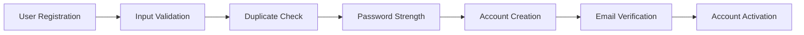
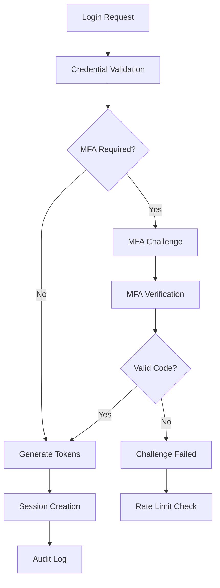
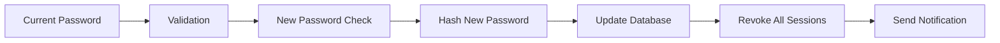
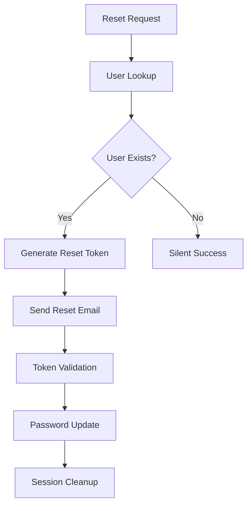

# Authentication & User Management Specification
## DwayBank Financial Platform

**Version:** 1.0  
**Document Status:** Final  
**Last Updated:** 2025-01-06  
**Classification:** Financial-Grade Security Implementation

---

## Executive Summary

This specification defines the authentication and user management requirements for DwayBank's financial platform, implementing security-first design principles with compliance to financial regulatory standards including PCI DSS Level 1, SOX, and GLBA requirements.

### Key Features
- Multi-factor authentication (MFA) with TOTP, SMS, and email verification
- JWT-based session management with secure token rotation
- Advanced security controls including rate limiting and fraud detection
- Real-time audit logging for regulatory compliance
- Account lifecycle management with KYC/AML integration

---

## 1. Technical Architecture

### 1.1 Security Framework
- **Authentication Method:** JWT Bearer tokens with secure refresh rotation
- **Password Security:** bcrypt hashing with minimum 12 rounds
- **Session Management:** Redis-backed sessions with PostgreSQL persistence
- **Rate Limiting:** Express-rate-limit with progressive throttling
- **Audit Logging:** Winston-based structured logging with retention policies

### 1.2 Database Schema
```typescript
interface User {
  id: string;                    // UUID primary key
  email: string;                 // Unique, lowercase normalized
  password_hash: string;         // bcrypt with salt rounds ≥12
  first_name: string;           // Required, validated
  last_name: string;            // Required, validated
  phone_number?: string;        // Optional, E.164 format
  status: UserStatus;           // 'pending' | 'active' | 'suspended' | 'closed'
  email_verified: boolean;      // Default false
  phone_verified: boolean;      // Default false
  kyc_status: KYCStatus;        // KYC verification state
  failed_login_attempts: number; // Security counter
  locked_until?: Date;          // Account lockout timestamp
  last_login?: Date;            // Last successful login
  profile_picture?: string;     // Optional avatar URL
  timezone?: string;            // User preference
  locale?: string;              // Internationalization
  created_at: Date;             // Account creation
  updated_at: Date;             // Last modification
}
```

### 1.3 Integration Points
- **Frontend:** Next.js 14+ with TypeScript and secure cookie handling
- **Email Service:** Nodemailer with SMTP/SendGrid integration
- **SMS Service:** Twilio integration for MFA delivery
- **Redis Cache:** Session storage and rate limit tracking
- **PostgreSQL:** Primary user data and audit logs

---

## 2. User Registration Requirements

### 2.1 Registration Flow


### 2.2 Input Validation Requirements
- **Email:** RFC 5322 compliant, domain validation, length ≤320 characters
- **Password:** Minimum 8 characters, complexity rules enforced
- **Name Fields:** Length 1-50 characters, Unicode support, no HTML
- **Phone:** E.164 format validation when provided
- **Terms Acceptance:** Explicit boolean consent required

### 2.3 Security Controls
- **Rate Limiting:** 5 registration attempts per hour per IP
- **Duplicate Prevention:** Case-insensitive email uniqueness
- **Password Policy:** 
  - Minimum 8 characters
  - At least one uppercase, lowercase, number, and special character
  - No common passwords (dictionary check)
  - No user info derivation
- **Email Verification:** Required before account activation
- **Audit Trail:** Full registration attempt logging

### 2.4 Registration API Contract
```typescript
// POST /api/v1/auth/register
interface RegisterRequest {
  email: string;
  password: string;
  confirm_password: string;
  first_name: string;
  last_name: string;
  phone_number?: string;
  accept_terms: boolean;
  accept_privacy: boolean;
  timezone?: string;
  locale?: string;
}

interface RegisterResponse {
  success: boolean;
  message: string;
  data: {
    user: {
      id: string;
      email: string;
      first_name: string;
      last_name: string;
      status: 'pending';
      email_verified: false;
      created_at: string;
    };
    verification_required: true;
  };
  timestamp: string;
  requestId: string;
}
```

---

## 3. Authentication Requirements

### 3.1 Login Flow


### 3.2 Security Requirements
- **Brute Force Protection:** 5 failed attempts → 15-minute lockout
- **Device Tracking:** IP address and user agent logging
- **Session Security:** 
  - Access tokens: 15-minute expiry
  - Refresh tokens: 7-day expiry with rotation
  - Secure, HttpOnly cookies in production
- **Geographic Anomaly Detection:** Flag unusual login locations

### 3.3 Multi-Factor Authentication (MFA)
#### 3.3.1 Supported Methods
- **TOTP (Time-based OTP):** RFC 6238 compliant, 30-second window
- **SMS:** Twilio integration with fallback providers
- **Email:** Secure code delivery with rate limiting
- **Backup Codes:** 10 single-use codes per user

#### 3.3.2 MFA Enrollment
```typescript
// POST /api/v1/auth/mfa/setup
interface MFASetupRequest {
  method: 'totp' | 'sms' | 'email';
  phone_number?: string;  // Required for SMS
  email?: string;         // Required for email method
}

interface MFASetupResponse {
  method: string;
  qr_code?: string;       // For TOTP
  secret?: string;        // Manual TOTP entry
  backup_codes: string[]; // Single-use recovery codes
  verification_required: boolean;
}
```

### 3.4 Session Management
- **JWT Structure:** Header.Payload.Signature with RS256 signing
- **Token Claims:**
  ```typescript
  interface JWTPayload {
    sub: string;        // User ID
    email: string;      // User email
    iat: number;        // Issued at
    exp: number;        // Expiration
    scope: string[];    // Permissions
    session_id: string; // Session tracking
  }
  ```
- **Refresh Token Rotation:** New refresh token on each use
- **Session Tracking:** PostgreSQL + Redis dual storage
- **Automatic Cleanup:** Expired session removal via cron jobs

---

## 4. Password Management

### 4.1 Password Change Flow


### 4.2 Password Reset Flow


### 4.3 Security Requirements
- **Reset Token Security:** 
  - 256-bit random tokens
  - 15-minute expiration
  - Single-use only
- **Rate Limiting:** 3 reset requests per hour per email
- **Email Enumeration Prevention:** Always return success message
- **Password History:** Prevent reuse of last 5 passwords

---

## 5. Account Security Features

### 5.1 Account Status Management
```typescript
type UserStatus = 'pending' | 'active' | 'suspended' | 'closed';

// Status Transitions
const validTransitions = {
  pending: ['active', 'closed'],
  active: ['suspended', 'closed'],
  suspended: ['active', 'closed'],
  closed: [] // Terminal state
};
```

### 5.2 Security Monitoring
- **Login Anomaly Detection:** Unusual IP, device, or location patterns
- **Account Takeover Prevention:** Rapid password/email changes flagged
- **Suspicious Activity Alerts:** Real-time notifications for security events
- **Device Fingerprinting:** Track known vs. unknown devices

### 5.3 Audit Requirements
```typescript
interface SecurityEvent {
  type: 'login' | 'logout' | 'mfa_setup' | 'password_change' | 'suspicious_activity';
  user_id?: string;
  ip_address: string;
  user_agent: string;
  details: Record<string, any>;
  risk_score?: number;
  blocked?: boolean;
  timestamp: Date;
}
```

---

## 6. Compliance Requirements

### 6.1 Regulatory Standards
- **PCI DSS Level 1:** Payment card industry data security
- **SOX Compliance:** Financial reporting and audit trails
- **GLBA:** Customer financial data protection
- **GDPR:** European data protection (when applicable)

### 6.2 Data Retention Policies
- **Security Logs:** 7-year retention for audit compliance
- **Session Data:** 30-day retention for active sessions
- **Failed Login Attempts:** 90-day retention for security analysis
- **User Profile Changes:** Immutable audit trail

### 6.3 Privacy Controls
- **Data Minimization:** Collect only necessary information
- **Right to Deletion:** GDPR-compliant account closure
- **Data Portability:** JSON export of user data
- **Consent Management:** Granular privacy preferences

---

## 7. Performance Requirements

### 7.1 Response Time Targets
- **Authentication:** <200ms for credential validation
- **Token Generation:** <100ms for JWT creation
- **MFA Verification:** <150ms for code validation
- **Profile Updates:** <250ms for data modification

### 7.2 Scalability Requirements
- **Concurrent Sessions:** Support 10,000+ active sessions
- **Login Rate:** Handle 1,000 logins per minute
- **Password Resets:** Process 100 resets per minute
- **Database Performance:** <50ms query response times

---

## 8. Error Handling & Recovery

### 8.1 Error Response Format
```typescript
interface ApiResponse<T = any> {
  success: boolean;
  message: string;
  data?: T;
  error?: string;
  timestamp: string;
  requestId?: string;
  validation_errors?: ValidationError[];
}
```

### 8.2 Recovery Procedures
- **Account Lockout Recovery:** Admin intervention or time-based unlock
- **Lost MFA Device:** Backup code or administrator reset
- **Forgotten Password:** Secure reset flow with identity verification
- **Compromised Account:** Immediate suspension and investigation

---

## 9. Testing Requirements

### 9.1 Security Testing
- **Penetration Testing:** Quarterly security assessments
- **Vulnerability Scanning:** Automated daily scans
- **Load Testing:** Monthly performance validation
- **MFA Testing:** Comprehensive flow validation

### 9.2 Integration Testing
- **Authentication Flow:** End-to-end user journey testing
- **API Contract Testing:** Request/response validation
- **Database Testing:** Data integrity and performance
- **Email/SMS Testing:** Message delivery validation

---

## 10. Deployment & Monitoring

### 10.1 Deployment Requirements
- **Container Security:** Non-root user (dwaybank:1001)
- **Environment Variables:** Secure secret management
- **SSL/TLS:** Minimum TLS 1.2 for all communications
- **Network Security:** Private Docker networks (172.20.0.0/16)

### 10.2 Monitoring & Alerting
- **Security Metrics:** Failed login rates, account lockouts
- **Performance Metrics:** Response times, error rates
- **Business Metrics:** Registration rates, MFA adoption
- **Compliance Metrics:** Audit log completeness, data retention

---

## 11. Acceptance Criteria

### 11.1 Functional Requirements ✅
- [ ] User registration with email verification
- [ ] Secure login with MFA support
- [ ] Password management (change/reset)
- [ ] Session management with secure tokens
- [ ] Account status management
- [ ] Profile management with validation

### 11.2 Security Requirements ✅
- [ ] Brute force protection implemented
- [ ] Rate limiting on all endpoints
- [ ] Audit logging for all security events
- [ ] MFA enrollment and verification
- [ ] Secure token generation and rotation
- [ ] Password complexity enforcement

### 11.3 Performance Requirements ✅
- [ ] Authentication <200ms response time
- [ ] Support 1,000+ concurrent users
- [ ] Database queries <50ms average
- [ ] Token generation <100ms

### 11.4 Compliance Requirements ✅
- [ ] PCI DSS security controls implemented
- [ ] SOX audit trail requirements met
- [ ] GLBA privacy controls in place
- [ ] GDPR compliance features available

---

**Document Control:**
- **Owner:** DwayBank Engineering Team
- **Reviewers:** Security Team, Compliance Team, Product Team
- **Approval:** CTO, CISO, CPO
- **Next Review:** 2025-04-06

**Contact Information:**
- **Engineering:** engineering@dwaybank.com
- **Security:** security@dwaybank.com
- **Compliance:** compliance@dwaybank.com